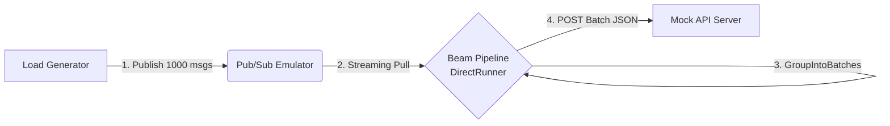

# Message Beam

Google Cloud Dataflow (Apache Beam) のバッチ Publish 機能をローカルで検証する環境です。
Pub/Sub Emulator と DirectRunner を使い、メッセージのバッチ化と流量制御を GCP 課金なしで検証できます。

## システム構成

クラウド上のコンポーネントをローカルの代替手段に置き換えています。

| クラウド構成 | ローカル検証構成 | 役割 |
| --- | --- | --- |
| Publisher | Load Generator (Python) | 1000 件のメッセージを生成するスクリプト |
| Cloud Pub/Sub | Pub/Sub Emulator | Google 公式エミュレータ (`gcloud` component) |
| Cloud Dataflow | DirectRunner | Apache Beam のローカル実行エンジン |
| External API | Mock Server (Flask) | バッチリクエストを受け取りログ出力する簡易サーバー |



## 前提条件

- Python 3.11+
- [uv](https://docs.astral.sh/uv/)
- [Google Cloud CLI](https://cloud.google.com/sdk/docs/install) (`gcloud`)
- Pub/Sub Emulator (`gcloud components install pubsub-emulator`)

## セットアップ

```bash
make install
```

## 起動方法

4 つのターミナルで順に実行します。

```bash
make all  # 手順を表示
```

### Terminal 1: Pub/Sub Emulator

```bash
make emulator
```

### Terminal 2: Mock API Server

```bash
make mock-server
```

### Terminal 3: Beam Pipeline

```bash
make pipeline
```

### Terminal 4: Load Generator

```bash
make generate
```

## パイプライン処理フロー

1. `ReadFromPubSub` で Pub/Sub からストリーミング読み取り
2. `AddRandomKeyFn` でランダムキー (0-9) を付与し KV ペア化
3. `GroupIntoBatches(batch_size=100, max_buffering_duration_secs=2)` で 100 件ずつバッチ化
4. `SendBatchToApiFn` で Mock Server に POST

## ファイル構成

| ファイル | 役割 |
| --- | --- |
| `mock_server.py` | バッチ受信用 Mock API サーバー (port 9000) |
| `generator.py` | Pub/Sub Emulator に 1000 件メッセージを Publish |
| `local_pipeline.py` | Beam パイプライン本体 |
| `Makefile` | 各コンポーネントの起動コマンド |
| `INSTRUCTION.md` | 設計書 |

## 設定値

| 項目 | 値 |
| --- | --- |
| Pub/Sub Emulator | `localhost:8085` |
| Mock Server | `localhost:9000` |
| Project ID | `my-local-project` |
| Topic | `my-topic` |
| Subscription | `my-sub` |
| バッチサイズ | 100 |
| バッファリング最大待機 | 2 秒 |

## 検証結果の見方

Mock Server (Terminal 2) のログを確認します。

バッチ化が正常に動作していれば、以下のようなログが出力されます。

```text
INFO:MockServer:Received Batch! Count: 100 items. (Sample ID: 0)
```

1000 件送信した場合、バッチログが複数回出力されます。
`max_buffering_duration_secs` のタイムアウトにより、端数のバッチが発生することがあります。
