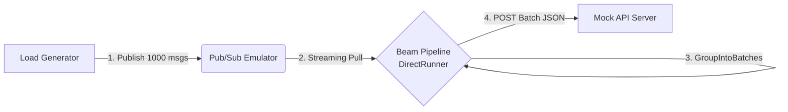

# Message Beam

Google Cloud Dataflow (Apache Beam) のバッチ Publish 機能をローカルで検証する環境です。
Pub/Sub Emulator と DirectRunner を使い、メッセージのバッチ化と流量制御を GCP 課金なしで検証できます。

## システム構成

クラウド上のコンポーネントをローカルの代替手段に置き換えています。

| クラウド構成 | ローカル検証構成 | 役割 |
| --- | --- | --- |
| Publisher | Load Generator (Python) | 1000 件のメッセージを生成するスクリプト |
| Cloud Pub/Sub | Pub/Sub Emulator | Google 公式エミュレータ (`gcloud` component) |
| Cloud Dataflow | DirectRunner | Apache Beam のローカル実行エンジン |
| External API | Mock Server (Flask) | バッチリクエストを受け取りログ出力する簡易サーバー |



## 前提条件

- Python 3.11+
- [uv](https://docs.astral.sh/uv/)
- [Google Cloud CLI](https://cloud.google.com/sdk/docs/install) (`gcloud`)
- Pub/Sub Emulator (`gcloud components install pubsub-emulator`)

## セットアップ

```bash
make install
```

## 起動方法

4 つのターミナルで順に実行します。

```bash
make all  # 手順を表示
```

### Terminal 1: Pub/Sub Emulator

```bash
make emulator
```

### Terminal 2: Mock API Server

```bash
make mock-server
```

### Terminal 3: Beam Pipeline

```bash
# おすすめ構成 (batch=50, sleep=0.8s)
make pipeline-recommend

# 構成 A (batch=30, sleep=0.5s)
make pipeline-a

# 構成 B (batch=75, sleep=1.5s)
make pipeline-b

# カスタム構成
make pipeline ARGS="--batch-size 20 --sleep 1.0 --buffer-duration 2.0"
```

### Terminal 4: Load Generator

```bash
make generate
```

### Emulator の停止

```bash
make stop-emulator
```

## パイプラインの CLI 引数

| 引数 | デフォルト | 説明 |
| --- | --- | --- |
| `--batch-size` | 100 | GroupIntoBatches のバッチサイズ |
| `--sleep` | 0.0 | バッチ送信後の sleep 秒数 (レート制御) |
| `--buffer-duration` | 2.0 | バッファリングタイムアウト (秒) |

## パイプライン処理フロー

1. `ReadFromPubSub` で Pub/Sub からストリーミング読み取り
2. `AddRandomKeyFn` でランダムキー (0-9) を付与し KV ペア化
3. `GroupIntoBatches` でバッチ化 (サイズ・タイムアウト設定可能)
4. `SendBatchToApiFn` で Mock Server に POST (sleep によるレート制御対応)

## ファイル構成

| ファイル | 役割 |
| --- | --- |
| `mock_server.py` | Mock API サーバー (port 9000, 3s ウィンドウ計測付き) |
| `generator.py` | Pub/Sub Emulator に 1000 件メッセージを Publish |
| `local_pipeline.py` | Beam パイプライン本体 |
| `simulator/` | 離散イベントシミュレータパッケージ (`python -m simulator`) |
| `simulation.py` | 互換 shim → `simulator` パッケージ |
| `explore_params.py` | 互換 shim → `simulator.explore` |
| `Makefile` | 各コンポーネントの起動コマンド |
| `INSTRUCTION.md` | 設計書 |
| `REPORT.md` | 初回パラメータ探索レポート |
| `REPORT-batch20-keys8.md` | batch=20/keys=8 構成の検証レポート |

## 設定値

| 項目 | 値 |
| --- | --- |
| Pub/Sub Emulator | `localhost:8085` |
| Mock Server | `localhost:9000` |
| Project ID | `my-local-project` |
| Topic | `my-topic` |
| Subscription | `my-sub` |

## 検証結果の見方

Mock Server (Terminal 2) のログで 3 秒スライディングウィンドウの計測値を確認します。

```text
Batch: 50 items | Window(3s): 100 msgs [OK] | Max: 150 | Latency: 0.42s
```

- `Window(3s)`: 直近 3 秒間のリクエスト数
- `[OK]` / `[NG]`: 165 リクエスト未満なら OK
- `Max`: セッション中の最大値

統計は API でも確認できます。

```bash
curl http://localhost:9000/stats
```

## シミュレーション

離散イベントシミュレーションでパラメータを事前検証できます。

```bash
# 単一シミュレーション
uv run python -m simulator simulate \
  --batch-size 50 --send-sleep 0.8 --max-concurrent 1

# グリッドサーチ (全組み合わせ探索)
uv run python -m simulator explore

# サマリーのみ表示
uv run python -m simulator explore --summary

# Mermaid チャート生成
uv run python -m simulator charts

# Makefile ショートカット
make simulate ARGS="--batch-size 50 --send-sleep 0.8"
make explore
make charts
```

旧コマンド (`uv run python simulation.py`,
`uv run python explore_params.py`) も互換 shim 経由で動作します。
