# batch_size=20 / keys=8 構成の検証レポート

## 検証した構成

| 項目 | 値 |
| --- | --- |
| batch_size | 20 |
| num_keys (シャード数) | 8 |
| max_buffering_duration_secs | 2 秒 |
| workers | min 2 / max 8 |
| API レイテンシ | 0〜1 秒 (一様分布) |
| 制約 | 3 秒ウィンドウで **165 リクエスト**未満 |

## 実行コマンド

```bash
# ワーカー数別シミュレーション
uv run python -m simulator simulate \
  --batch-size 20 --num-keys 8 \
  --max-concurrent 8

# batch_size を変えた比較
uv run python -m simulator simulate \
  --batch-size 75 --num-keys 8 \
  --max-concurrent 8
```

## 検証結果

### ワーカー数スイープ (sleep=0)

```text
$ for w in 1 2 3 4 5 6 8; do
    uv run python -m simulator simulate \
      --batch-size 20 --num-keys 8 \
      --max-concurrent $w
  done
```

| workers | max req/3s | throughput | 結果 |
| ---: | ---: | ---: | --- |
| 1 | 11 | 61.3 msg/s | OK |
| 2 | 18 | 115.3 msg/s | OK |
| 3 | 25 | 162.7 msg/s | OK |
| 4 | 33 | 216.7 msg/s | OK |
| 5 | 40 | 270.0 msg/s | OK |
| 6 | 47 | 324.7 msg/s | OK |
| 8 | 63 | 430.0 msg/s | OK |

```mermaid
xychart-beta
    title "ワーカー数 vs スループット (batch=20, keys=8)"
    x-axis "workers" ["1", "2", "3", "4", "5", "6", "8"]
    y-axis "件数"
    bar "throughput (msg/s)" [61.3, 115.3, 162.7, 216.7, 270.0, 324.7, 430.0]
    bar "max req/3s" [11, 18, 25, 33, 40, 47, 63]
    line "制約 165 req/3s" [165, 165, 165, 165, 165, 165, 165]
```



**全ワーカー数で制約を満たす。**
workers=8 でも max=63 req/3s であり、制約 165 に対して
62% の余裕がある。autoscaler の拡張は問題ない。

### batch_size を変えた場合の比較

workers=8 で batch_size を変更した場合:

```text
$ uv run python -m simulator simulate \
    --batch-size 20 --num-keys 8 --max-concurrent 8
  → max req/3s=63  throughput=430.0 msg/s

$ uv run python -m simulator simulate \
    --batch-size 50 --num-keys 8 --max-concurrent 8
  → max req/3s=63  throughput=1073.3 msg/s

$ uv run python -m simulator simulate \
    --batch-size 75 --num-keys 8 --max-concurrent 8
  → max req/3s=63  throughput=1610.0 msg/s
```

リクエスト数は同一 (63 req/3s) のまま、
batch_size に比例してスループットが向上する。

## パラメータ考察

### autoscaler との関係

旧レポートでは「autoscaler で workers が増えると制約を
満たせなくなる」と結論付けていたが、これは制約の対象を
メッセージ数と誤認していたためである。

制約がリクエスト回数の場合:

- workers=8 でも max=63 req/3s (制約 165 の 38%)
- **autoscaler による workers 増加は問題にならない**
- workers を増やすほどスループットが向上する

### sleep は不要

```text
$ uv run python -m simulator simulate \
    --batch-size 20 --num-keys 8 \
    --max-concurrent 8 --send-sleep 1.0
  → max req/3s=19  throughput=141.3 msg/s
```

sleep=1.0s でスループットが 430→141 msg/s に低下する。
制約は元々満たしているため、sleep のメリットはない。

### batch_size を上げるべき

batch=20 の構成は制約に対して安全だが、スループットが低い。
batch_size を上げても制約は変わらないため、
外部 API が許容する範囲で batch_size を大きくすることを推奨。

| batch | workers | max req/3s | throughput |
| ---: | ---: | ---: | ---: |
| 20 | 8 | 63 | 430.0 msg/s |
| 50 | 8 | 63 | 1,073.3 msg/s |
| 75 | 8 | 63 | 1,610.0 msg/s |

## おすすめ構成

### `batch=75, keys=8, workers=max 8`

| 項目 | 値 |
| --- | --- |
| batch_size | 75 |
| num_keys | 8 |
| max_buffering_duration_secs | 2 秒 |
| max_num_workers | 8 |
| send_sleep_secs | 0 |
| max req/3s | 63 |
| throughput | 1,610 msg/s |

- 提案構成の keys=8 を維持しつつ batch_size を拡大
- autoscaler で workers=8 まで拡張しても制約を満たす
- sleep 不要でシンプルな構成

## 再現手順

```bash
# 提案構成の検証
uv run python -m simulator simulate \
  --batch-size 20 --num-keys 8 --max-concurrent 8

# batch_size 拡大の効果
uv run python -m simulator simulate \
  --batch-size 75 --num-keys 8 --max-concurrent 8

# ローカル実環境での検証
make pipeline ARGS="--batch-size 75"
```
