# Dataflow ハイパーパラメータ探索レポート

## 前提条件

| 項目 | 値 |
| --- | --- |
| 入力レート | 4,000 msg/s (Pub/Sub 経由) |
| 外部 API レイテンシ | 0〜1 秒 (一様分布) |
| 制約 | 3 秒ウィンドウで **165 リクエスト**未満 |

制約はメッセージ数ではなく **API 呼び出し回数** に対して適用される。
1 回のリクエストで `batch_size` 件のメッセージを送信するため、
バッチサイズを大きくすればリクエスト数を増やさずにスループットを
向上できる。

## 実行コマンド

```bash
# 単一シミュレーション
uv run python -m simulator simulate \
  --batch-size 50 --num-keys 5 --max-concurrent 10

# グリッドサーチ (7,560 通り)
uv run python -m simulator explore

# サマリーのみ表示
uv run python -m simulator explore --summary

# Mermaid チャート生成
uv run python -m simulator charts
```

## グリッドサーチ結果

### 探索パラメータ

| パラメータ | 探索範囲 |
| --- | --- |
| `num_keys` | 1, 2, 3, 5, 10, 20 |
| `batch_size` | 20, 25, 30, 35, 40, 50, 75 |
| `max_buffering_duration_secs` | 0.5, 1, 2, 3, 5, 10 |
| `max_concurrent_sends` | 1, 2, 3, 5, 10 |
| `send_sleep_secs` | 0.0, 0.3, 0.5, 0.8, 1.0, 1.5 |

合計 7,560 通りを各 30 秒間シミュレートした。

### 実行結果

```text
$ uv run python -m simulator explore --summary

Total combinations: 7560
Constraint satisfied (< 165 reqs/3s): 7560
Constraint violated (>= 165 reqs/3s): 0
```

**7,560 通りすべてが制約を満たした。**

スループット上位 (制約を満たしたもの):

| keys | batch | buffer | concur | sleep | req/3s | tput |
| ---: | ---: | ---: | ---: | ---: | ---: | ---: |
| 1 | 75 | 0.5 | 10 | 0.0 | 75 | 2,022.5 |
| 5 | 75 | 0.5 | 10 | 0.0 | 69 | 2,020.0 |
| 1 | 75 | 0.5 | 10 | 0.3 | 47 | 1,357.5 |
| 5 | 75 | 0.5 | 10 | 0.3 | 44 | 1,357.5 |
| 1 | 50 | 0.5 | 10 | 0.0 | 75 | 1,350.0 |

## パラメータ考察

### 1. batch_size — スループットへの影響が最大

```text
$ uv run python -m simulator simulate \
    --batch-size 20 --num-keys 3 --max-concurrent 5
  → max req/3s=39  throughput=258.0 msg/s

$ uv run python -m simulator simulate \
    --batch-size 50 --num-keys 3 --max-concurrent 5
  → max req/3s=38  throughput=643.3 msg/s

$ uv run python -m simulator simulate \
    --batch-size 75 --num-keys 3 --max-concurrent 5
  → max req/3s=39  throughput=962.5 msg/s
```



```mermaid
xychart-beta
    title "バッチサイズ vs スループット (concurrency=5)"
    x-axis "batch_size" ["20", "30", "40", "50", "75"]
    y-axis "件数"
    bar "throughput (msg/s)" [258.0, 386.0, 514.7, 643.3, 962.5]
    bar "max req/3s" [39, 38, 38, 38, 39]
```

リクエスト数はほぼ一定 (38〜39 req/3s) のまま、バッチサイズに
比例してスループットが増加する。
制約が「リクエスト回数」であるため、1 リクエストあたりの
メッセージ数を増やすことが最も効果的。

### 2. max_concurrent_sends — 並列度

```text
$ uv run python -m simulator simulate \
    --batch-size 50 --num-keys 3 --max-concurrent 1
  → max req/3s=10  throughput=131.7 msg/s

$ uv run python -m simulator simulate \
    --batch-size 50 --num-keys 3 --max-concurrent 5
  → max req/3s=38  throughput=643.3 msg/s

$ uv run python -m simulator simulate \
    --batch-size 50 --num-keys 3 --max-concurrent 10
  → max req/3s=73  throughput=1293.3 msg/s
```



```mermaid
xychart-beta
    title "同時送信数 vs スループット / max req(3s)"
    x-axis "同時送信数" ["1", "2", "3", "5", "10"]
    y-axis "件数"
    bar "throughput (msg/s)" [131.7, 268.3, 383.3, 643.3, 1293.3]
    bar "max req/3s" [10, 18, 25, 38, 73]
```

concurrency を上げるとリクエスト数も比例して増加するが、
concurrency=10 でも max=73 req/3s であり制約 165 に対して
十分な余裕がある。
API レイテンシの平均 0.5 秒がボトルネックとなり、
3 秒間に 1 ワーカーが処理できるリクエスト数は
約 6〜7 回に制限される。

### 3. send_sleep_secs — 不要

制約がリクエスト回数の場合、sleep を入れてもリクエスト数は
元々制約を大きく下回っているため、スループットが低下するだけで
メリットがない。

```text
$ uv run python -m simulator simulate \
    --batch-size 50 --num-keys 5 --max-concurrent 10
  → max req/3s=69  throughput=1286.7 msg/s  (sleep=0)

$ uv run python -m simulator simulate \
    --batch-size 50 --num-keys 5 --max-concurrent 10 \
    --send-sleep 0.8
  → max req/3s=26  throughput=516.7 msg/s  (sleep=0.8)
```

sleep=0.8s で throughput が 60% 低下し、制約への余裕は
変わらず十分。**sleep は不要。**

### 4. num_keys / max_buffering_duration_secs — 影響なし

グリッドサーチの結果、`num_keys` と
`max_buffering_duration_secs` はスループットおよび
リクエスト数にほとんど影響しない。
同じ `batch_size` / `concurrency` / `sleep` の組み合わせでは、
`num_keys` や `buffer` の値に関わらず結果がほぼ同一になる。

## おすすめ構成

```mermaid
xychart-beta
    title "おすすめ構成比較"
    x-axis "構成" ["b75/c10", "b50/c10", "b20/c8", "b20/c3"]
    y-axis "件数"
    bar "throughput (msg/s)" [2020.0, 1286.7, 430.0, 162.7]
    bar "max req/3s" [69, 69, 63, 25]
    line "制約 165 req/3s" [165, 165, 165, 165]
```



### 第 1 候補: `batch=75, concurrency=10`

```text
$ uv run python -m simulator simulate \
    --batch-size 75 --num-keys 5 --max-concurrent 10
```

| 項目 | 値 |
| --- | --- |
| batch_size | 75 |
| max_concurrent_sends | 10 |
| send_sleep_secs | 0 |
| max req/3s | 69 |
| throughput | 2,020 msg/s |

- 最高スループット (2,020 msg/s)
- 制約に対して 58% の余裕 (69/165)
- 4,000 msg/s の入力のうち約 50% を処理可能

### 第 2 候補: `batch=50, concurrency=10`

```text
$ uv run python -m simulator simulate \
    --batch-size 50 --num-keys 5 --max-concurrent 10
```

| 項目 | 値 |
| --- | --- |
| batch_size | 50 |
| max_concurrent_sends | 10 |
| send_sleep_secs | 0 |
| max req/3s | 69 |
| throughput | 1,287 msg/s |

- バッチサイズを小さくして 1 リクエストの負荷を抑える構成
- 制約には十分な余裕がある

### 第 3 候補: `batch=20, concurrency=8`

```text
$ uv run python -m simulator simulate \
    --batch-size 20 --num-keys 8 --max-concurrent 8
```

| 項目 | 値 |
| --- | --- |
| batch_size | 20 |
| max_concurrent_sends | 8 |
| send_sleep_secs | 0 |
| max req/3s | 63 |
| throughput | 430 msg/s |

- 提案構成 (batch=20, keys=8) に近い構成
- autoscaler で max=8 まで拡張しても制約を満たす

## 結論

制約が **リクエスト回数** (165 req/3s) の場合、
API レイテンシ (0〜1s) がボトルネックとなり、
探索した全パラメータ組み合わせで制約を満たす。

スループットを最大化するには:

1. **batch_size を大きくする** — 最も効果的
   (リクエスト数を増やさずにメッセージ数を増やせる)
2. **concurrency を上げる** — 並列度で処理速度を向上
3. **sleep は不要** — リクエスト数は元々制約を大きく下回る

## 再現手順

```bash
# グリッドサーチ実行 (約 26 分)
uv run python -m simulator explore

# サマリー表示
uv run python -m simulator explore --summary

# 個別シミュレーション
uv run python -m simulator simulate \
  --batch-size 75 --num-keys 5 --max-concurrent 10
```
